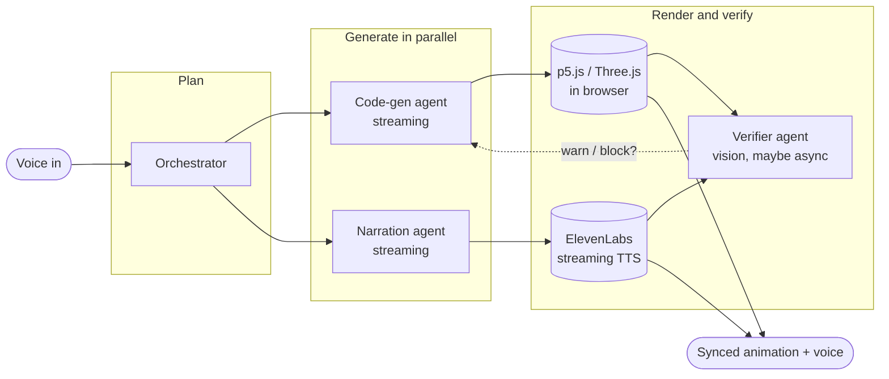

# Mira

> **The visualization layer for thinking.** (idea stage, nothing built yet)

Mira is a generative visualization engine. You speak an idea, and it produces a Ciechanowski/3Blue1Brown-style animated, narrated explanation of that concept on demand, in seconds. Parallel Gemini 3.5 Flash sub-agents generate a synchronized in-browser animation plus narration, and your follow-up questions morph the existing scene instead of starting over. Think of it as a creative tool for turning ideas into moving visuals, the same category as a generative-art engine, not an assistant that answers questions for you.

I just had this idea at the Google I/O Hackathon, May 2026. This README is me thinking it through, not documentation for something that runs. The repo is empty. Treat everything below as a target I want to hit, not a feature that exists.

---

## The problem I'm chasing

Most ideas live as text or equations, which is a compressed format that throws away the spatial, moving, cause-and-effect structure that made the idea legible in the first place. Visualization is how you get that structure back, but right now building it is artisanal and expensive. Bartosz Ciechanowski spends months on a single essay. Grant Sanderson spends days per 3Blue1Brown video. The output is incredible, but it doesn't scale to "render this one idea for me right now."

So what do I actually do about it? The bet is that the artisanal layer underneath, the part where someone hand-codes an animation that matches a narration, has gotten cheap enough in 2026 to automate. If that's true, any concept could get its own short Ciechanowski-style piece without the three months. If it's not true yet, this is a 2027 idea and I'm early.

---

## What I'm picturing

You speak any question, and a fan-out of Gemini 3.5 Flash sub-agents produces an animation and narration together. The animation runs in-browser (p5.js for 2D, Three.js for 3D). The narration plays through ElevenLabs. Then you ask a follow-up, and instead of regenerating from scratch, the system mutates the scene that's already on screen.

The closest references are 3Blue1Brown for animated math and Bartosz Ciechanowski for interactive web essays. Both are human authors doing slow, deliberate work. What I'm hoping for is the layer underneath them, automated, so the input is a spoken sentence instead of weeks of authoring.

I'm honestly not sure the quality holds. The whole thing rests on whether a code-gen agent can write animation code that's good enough to sit next to Ciechanowski's name without embarrassing itself. That's the open question that scares me most.

---

## Queries I'd want to demo

If this works, here's the kind of thing I'd want someone to be able to ask:

| Domain | Query |
|---|---|
| Finance | "Animate how a Fed rate cut ripples through the mortgage market." |
| Machine Learning | "Visualize how a transformer attention head attends across a sentence." |
| Physics | "Show me what happens to a star's core when it collapses into a black hole." |
| Energy | "Animate how a lithium-ion battery actually charges and discharges." |
| Algorithms | "Show me how Dijkstra's algorithm finds the shortest path." |

In reality I expect some of these are way harder to animate than others, and the finance one might be the only one that looks good early because the visual vocabulary (flows, arrows, bars) is simpler than, say, rendering a collapsing stellar core. I'd start narrow and see what holds.

---

## Why I think the timing might be right

Mira sits on top of a few capabilities that I think only got cheap enough in 2026 to make this product class plausible. I'm not certain on any of these, so this is more "here's my thesis" than "here's why it works."

- **Sub-agent fan-out at conversational latency.** The plan would be to run multiple Gemini 3.5 Flash agents in parallel per query (an orchestrator, code-gen, narration, and a verifier). Six months ago the same fan-out at frontier-model prices would have been too expensive to feel live. Whether it's actually fast enough now, I don't know yet.
- **Code generation fast enough to feel live.** The code-gen agent would need to write p5.js or Three.js and stream it into the browser as it's produced. I'm hoping for something in the few-seconds range, but I have no real measurement, just a hope.
- **Vision-based self-verification.** This is the piece I'm least sure about. The idea is a verifier agent uses Gemini 3.5 Flash vision to check that the rendered animation actually matches what the narration is saying, and blocks bad output before the user sees it. The catch is that a vision pass takes time, and time is exactly the budget I don't have. Open question whether this is viable live or has to run async and just warn.
- **Thought preservation across follow-ups.** Gemini 3.5 Flash can carry intermediate reasoning across multi-turn conversations, so in theory when you say "now show me what happens if rates stay high for two more years," the agent keeps the scene state and mutates it. In practice I haven't tested whether the carryover is reliable enough to patch code instead of rewriting it.
- **Long context.** The 1M-token window could hold the conversation history, the generated code, and the scene state in one place, which would mean no vector DB and no RAG layer. That simplifies a lot, assuming it actually fits.

---

## Rough sketch of the agent fan-out

This is a sketch of how I'm imagining the pieces fit, not a finished architecture. I expect it to change once I build the first version and find out what's slow.



The follow-up path is the part I haven't figured out. The hope is that on a follow-up the orchestrator emits a "mutate scene" plan instead of a "new scene" plan, and the code-gen agent patches the existing JavaScript instead of rewriting it. How that diff actually works, what state the patch needs, and whether thought preservation is enough to carry the context, are all unknown right now.

---

## The sub-agents I have in mind

Four roles, all on `gemini-3.5-flash`, each at the lowest thinking level that still holds quality. This split is a guess and I'd expect to merge or drop one once I see where the latency goes.

| Agent | Role (intended) |
|---|---|
| Orchestrator | Parses voice intent, emits a typed scene plan with phases. |
| Code-gen | Writes p5.js (2D) or Three.js (3D) per phase, streamed into the browser sandbox. |
| Narration | Voice script with phase-aligned timestamps, streamed into ElevenLabs. |
| Verifier | Reads rendered frames, checks the picture matches the narration, flags drift. |

The whole design lives or dies on the latency budget. I'm aiming for sub-3-second first-frame-out, but I genuinely have no idea if that's achievable yet, and I can already see the verifier and the code-gen step both fighting for that same budget.

---

## The stack I'd reach for

This is the default stack I'd start with, mostly because I know it and it's fast to move in, not because I've validated any of it for this use case.

| Layer | Tech |
|---|---|
| Frontend | Next.js (App Router) + TypeScript + Tailwind |
| Entry surface | Cmd+K command palette, Raycast-inspired |
| Models | `gemini-3.5-flash` across the agents, thinking level varied per role |
| SDK | `@google/genai` (JavaScript) |
| Animation runtime | p5.js (2D), Three.js (3D), GSAP for transitions |
| Math typography | KaTeX |
| Voice STT | Web Speech API (browser-native) |
| Voice TTS | ElevenLabs (streaming) |
| Realtime | SSE for narration and code-phase streaming |
| Hosting | Vercel |

If the 1M context holds the way I hope, there's no ORM and no vector DB here, which is part of why I want to try it this way.

---

## Open questions / what I haven't figured out

This is the honest list. None of these are solved.

- **Latency.** Is sub-3-second first-frame even possible with a four-agent fan-out plus a vision check? I have no measurement. This could kill the whole "feels live" premise.
- **Vision verification cost.** A verifier reading rendered frames is the most expensive step in the loop. Does it run inline and block, or async and warn? If it has to be async, does the user end up watching wrong animations?
- **Scene morphing.** I keep saying follow-ups "morph the scene," but I don't actually know how to diff and patch generated animation code reliably. What's the scene state representation? Does the code-gen agent patch JS, or do I need an intermediate scene format it edits instead?
- **Animation quality.** Can a code-gen agent write p5.js/Three.js that's good enough to deserve the Ciechanowski comparison, or does it produce generic-looking shapes that undercut the whole pitch? This is the existential one.
- **Domain coverage.** "Any concept" is a big claim. I suspect it works for a handful of visually-simple domains and falls apart on the rest. Which ones actually hold?
- **Narration/animation sync.** Getting the voice and the visuals phase-aligned to timestamps, while both are streaming, sounds hard. I haven't thought through how the timing contract works between the two agents.
- **Failure modes.** What happens when the code-gen agent writes JS that throws, or renders nothing, or the narration finishes before the animation does? I have no fallback designed yet.
- **Cost per query.** Four agents per query, one of them doing vision, adds up. I don't have a number, and it matters for whether this is a product or just a cool demo.

---

## Aesthetic I'm aiming for

If I get the engine working, the animation look I want borrows from Bartosz Ciechanowski's editorial work at ciechanow.ski, since that's the bar.

- Soft palette: muted yellows, greens, blues, terracotta on near-black paper
- Thin 1.5px strokes, never harsh outlines
- Slow easing curves
- Flat shading on 3D scenes, no glossy materials
- KaTeX for inline math
- Paused-by-default playback, the user controls the tempo

For the app shell itself I'm picturing an editorial dark mode, frosted glass, keyboard-first, with Cmd+K as the primary way in. UI reference points: Raycast, Linear, Arc's command bar.

---

## Where this sits relative to existing work

Mira would live near two references I keep coming back to, and the point of difference is the input and the interaction, not the output quality (which is the part I still have to earn).

| | 3Blue1Brown / Manim | Bartosz Ciechanowski | **Mira (what I'm hoping for)** |
|---|---|---|---|
| Input | Python code | Hand-written essays | A spoken sentence |
| Time to produce | Days | Months | Seconds, if it works |
| Domain | Math, CS | Physics, hardware | Anything, hopefully |
| Interactive | No | Sliders only | Voice follow-up morphs the scene |
| Voice | None | None | Two-way |

The thing I'd want to be first at is this: you speak a sentence, get an animated narrated explanation back, and then steer it conversationally. Whether the output is actually as good as the references is exactly what I don't know yet.

---

## How I'd lay out the repo (rough idea)

I haven't written any of this. This is just where I think things would go so I'm not starting from a blank folder.

```
mira/
├── app/         Next.js App Router, agent endpoints + scene pages
├── lib/
│   ├── agents/  Per-agent prompts and schemas
│   ├── scene/   Scene plan types and state
│   ├── render/  p5.js + Three.js sandbox
│   └── voice/   STT and TTS wiring
├── components/  Cmd+K palette, render surface, captions
└── public/      Pre-cached demo bundles, eventually
```

This will change. The scene state layer in particular is hand-wavy because I haven't figured out the morphing question above.

---

## Running it (once it exists)

There's nothing to run yet. When there is, the rough plan would be Node 22+, a Gemini API key from https://aistudio.google.com/api-keys, and an ElevenLabs API key.

```bash
git clone https://github.com/Macintosh1011/mira.git
cd mira
# install, add API keys to a local env file, run dev server
```

Environment variables I'd expect to need: `GEMINI_API_KEY`, `ELEVENLABS_API_KEY`, `ELEVENLABS_VOICE_ID`. Never commit a real key. The hackathon key auto-revokes if it lands in a public repo.

---

## Acknowledgments

- **Bartosz Ciechanowski** (ciechanow.ski): the aesthetic north star. Mira is what his essays might look like if they could be authored conversationally.
- **Grant Sanderson / 3Blue1Brown**: the proof that animated explanation is a delivery layer of its own.
- **The Manim community**: the open-source engine behind 3Blue1Brown. Mira wouldn't use Manim directly (too slow to render live) but inherits the philosophy.
- **Google DeepMind** for Gemini 3.5 Flash and the hackathon quota.

---

Idea sketched at the Google I/O Hackathon, May 2026. Nothing built yet.
